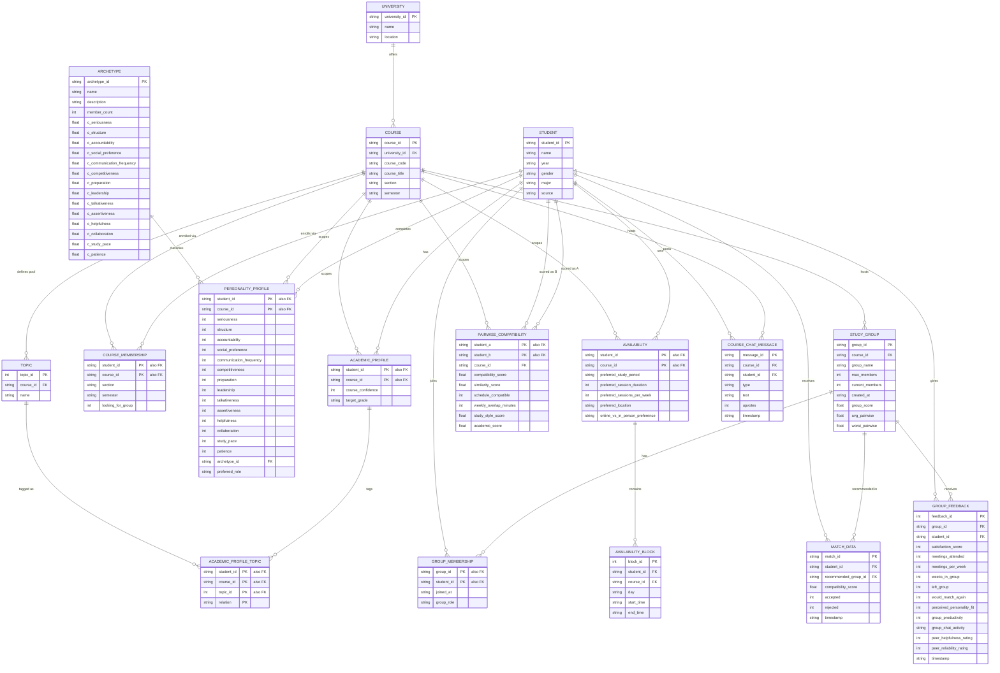

# StudyMatch — Sample Database ER Diagram

Schema for `data/studymatch.db` (SQLite), built by `build_database.py` from
`schema.sql` + `sample/*.json`. GitHub renders the diagram below natively;
see `schema.sql` for the full DDL (types, `CHECK` constraints, defaults).

Rendered version with row counts and design-decision notes:
https://claude.ai/code/artifact/ea7b2a43-c040-44fe-9049-af37e590cddc

## Design decisions

- **Matching scope**: compatibility is personality similarity only.
  `availability` / `availability_block` and `academic_profile` are fully
  populated, real input data — just excluded from `compatibility_score` and
  `group_score`. The `study_style_score` / `academic_score` columns on
  `pairwise_compatibility` are computed and stored the same way: zero weight.
- **No complementarity**: the old formula rewarded personality *differences*
  on 4 traits. Dropped — a good pair is simply a similar one across all 14
  traits now. `group_score` lost its diversity/"balance" term the same way.
- **Wide columns, not EAV**: personality traits and archetype centroids stay
  as wide columns — each is genuinely single-valued per row, so splitting
  them into a generic key/value table would be the EAV anti-pattern, not
  better normalization.
- **Junction tables where there were real lists**: `availability_block` and
  `academic_profile_topic` exist because their source fields were lists
  (multiple time blocks, multiple topics) — genuine 1NF repeating groups,
  correctly split out.
- **De-duplication**: `student` no longer repeats `course` / `course_section`
  — `course_membership` already owns that relationship (and now also owns
  `looking_for_group`, which is really per-course, not per-student).
- **Provenance**: `student.source` (`'synthetic'` or `'real'`) lets fake and
  real people coexist in the same tables while staying distinguishable. See
  `add_student.py` — it adds a real student's raw data, assigns them an
  archetype by nearest *existing* centroid (no re-clustering), computes their
  `pairwise_compatibility` against course-mates, and generates recruiting
  recommendations — all as pure inserts, never touching an existing
  `study_group`/`group_membership` row or another student's data.
  `build_database.py`'s destructive rebuild refuses to run over real rows
  unless you pass `--force`.

## Diagram

**Notation**: `||` = exactly one, `o{` = zero or many. `PK "also FK"` marks a
composite key column that is also a foreign key.
