# StudyMatch — Sample Database ER Diagram

Schema for [`data/studymatch.db`](../data/studymatch.db) (SQLite), built by
[`data/build_database.py`](../data/build_database.py) from
[`data/schema.sql`](../data/schema.sql) + `data/sample/*.json`. GitHub renders
the diagram below natively; see `schema.sql` for the full DDL (types, `CHECK`
constraints, defaults).

Rendered version with row counts and design-decision notes:
https://claude.ai/code/artifact/ea7b2a43-c040-44fe-9049-af37e590cddc

## Design decisions

- **Matching scope**: compatibility is personality similarity only.
  `availability` / `availability_block` is fully populated, real input data —
  just excluded from `compatibility_score` and `group_score`. The
  `study_style_score` column on `pairwise_compatibility` is computed and
  stored the same way: zero weight.
- **No complementarity**: the old formula rewarded personality *differences*
  on 4 traits. Dropped — a good pair is simply a similar one across all 6
  survey axes now. `group_score` lost its diversity/"balance" term the same way.
- **Survey instrument**: the entry survey is a fixed 24-item, 5-point Likert
  instrument (MSLQ-informed, "Version 3" of the redesign) — 6 axes x 4 items
  each. Raw answers are stored per-item in `survey_response`; the 6 axis
  scores in `personality_profile` are derived from them (reverse-coding
  applied where an item is worded in the opposite direction) — see
  [`algorithm/scoring.py`](../algorithm/scoring.py) for the item bank and
  scoring function, used identically by real submissions and synthetic data.
- **No academic topic tracking**: `topic` and `academic_profile_topic` were
  removed entirely (not just excluded from scoring, unlike availability).
  `academic_profile` now only carries `course_confidence`/`target_grade`.
- **Wide columns, not EAV**: personality traits and archetype centroids stay
  as wide columns — each is genuinely single-valued per row, so splitting
  them into a generic key/value table would be the EAV anti-pattern, not
  better normalization.
- **Junction table where there's a real list**: `availability_block` exists
  because its source field was a list (multiple time blocks per student) —
  a genuine 1NF repeating group, correctly split out.
- **De-duplication**: `student` no longer repeats `course` / `course_section`
  — `course_membership` already owns that relationship (and now also owns
  `looking_for_group`, which is really per-course, not per-student).
- **Provenance**: `student.source` (`'synthetic'` or `'real'`) lets fake and
  real people coexist in the same tables while staying distinguishable. See
  [`data/add_student.py`](../data/add_student.py) — it adds a real student's
  raw data, assigns them a study type by soft membership against the *stored*
  type model (no re-fit), computes their `pairwise_compatibility` against
  course-mates, and generates recruiting recommendations — all as pure
  inserts, never touching an existing `study_group`/`group_membership` row or
  another student's data. `build_database.py`'s destructive rebuild refuses
  to run over real rows unless you pass `--force`. The live equivalent —
  [`app.py`](../app.py)'s `/survey` — actually places the new student into a
  group instead of just recommending one; see
  [`algorithm/placement.py`](../algorithm/placement.py).
- **Login accounts are separate from students, on purpose**: `user_account`
  exists (and can log in) *before* any survey is ever taken - `student_id`
  starts `NULL` and is set once, which is also how login knows whether to
  route someone to `/survey` or `/home`. Deleting a student sets any pointing
  `user_account.student_id` back to `NULL` rather than leaving a dangling
  reference; deleting an account leaves their student/survey data alone.
  Passwords are hashed (stdlib PBKDF2, see
  [`data/auth.py`](../data/auth.py)) — never stored plain.
- **Email verification**: password accounts start with `verified_at` NULL and a
  6-digit `verify_token` emailed to them. Entering the code together with the
  password sets `verified_at`, clears the code, and starts a session. Google
  accounts are created already verified.
- **Sessions expire server-side**: `session.expires_at` (30 days from login)
  is checked on every request in `app.py`'s `current_user()`, not just left
  to the cookie's client-side `max_age`. Expired rows are swept on each new
  login rather than needing a separate cleanup job.
- **`pairwise_compatibility` is keyed per course**: `course_id` is part of the
  primary key (not just a column), because personality is scoped per course
  and the same two students could in principle share more than one course —
  without `course_id` in the key, a second shared course's row would collide
  with the first instead of coexisting.
- **Two chat tables, two purposes**: `course_chat_message` is the course-wide
  Q&A board (typed posts, upvotes), synthetic sample data only.
  `group_chat_message` is the private chat behind `/chat`, readable and
  writable only by that group's members (checked on every request in
  `app.py`). Its `message_id` is an `AUTOINCREMENT` integer rather than a
  `msg_0001`-style string so the page can poll for "everything after the last
  id I have". It starts empty and is never loaded from `sample/`. `app.py`
  also creates it on startup (`CREATE TABLE IF NOT EXISTS`), which is how the
  live Turso database, never rebuilt from `schema.sql`, picks it up. Deleting
  a student deletes their messages; deleting a group's last member deletes
  the group's chat with it.

## Diagram

```mermaid
erDiagram
    UNIVERSITY ||--o{ COURSE : offers
    USER_ACCOUNT |o--o| STUDENT : "linked to (after survey)"
    USER_ACCOUNT ||--o{ SESSION : "logged in via"
    STUDENT ||--o{ COURSE_MEMBERSHIP : "enrolls via"
    COURSE ||--o{ COURSE_MEMBERSHIP : "enrolled via"
    STUDENT ||--o{ PERSONALITY_PROFILE : completes
    COURSE ||--o{ PERSONALITY_PROFILE : scopes
    ARCHETYPE ||--o{ PERSONALITY_PROFILE : classifies
    STUDENT ||--o{ SURVEY_RESPONSE : answers
    COURSE ||--o{ SURVEY_RESPONSE : scopes
    STUDENT ||--o{ AVAILABILITY : sets
    COURSE ||--o{ AVAILABILITY : scopes
    AVAILABILITY ||--o{ AVAILABILITY_BLOCK : contains
    STUDENT ||--o{ ACADEMIC_PROFILE : has
    COURSE ||--o{ ACADEMIC_PROFILE : scopes
    STUDENT ||--o{ PAIRWISE_COMPATIBILITY : "scored as A"
    STUDENT ||--o{ PAIRWISE_COMPATIBILITY : "scored as B"
    COURSE ||--o{ PAIRWISE_COMPATIBILITY : scopes
    COURSE ||--o{ STUDY_GROUP : hosts
    STUDY_GROUP ||--o{ GROUP_MEMBERSHIP : has
    STUDENT ||--o{ GROUP_MEMBERSHIP : joins
    STUDY_GROUP ||--o{ MATCH_DATA : "recommended in"
    STUDENT ||--o{ MATCH_DATA : receives
    COURSE ||--o{ COURSE_CHAT_MESSAGE : hosts
    STUDENT ||--o{ COURSE_CHAT_MESSAGE : posts
    STUDY_GROUP ||--o{ GROUP_CHAT_MESSAGE : "chats in"
    STUDENT ||--o{ GROUP_CHAT_MESSAGE : sends
    STUDY_GROUP ||--o{ GROUP_FEEDBACK : receives
    STUDENT ||--o{ GROUP_FEEDBACK : gives

    USER_ACCOUNT {
        string user_id PK
        string email
        string password_hash "NULL for Google-only"
        string google_sub "unique, NULL for password-only"
        string created_at
        string student_id FK "unique, nullable"
        string verified_at "NULL until verified"
        string verify_token "6-digit code while unverified, then NULL"
    }
    SESSION {
        string session_token PK
        string user_id FK
        string created_at
        string expires_at
    }
    UNIVERSITY {
        string university_id PK
        string name
        string location
    }
    COURSE {
        string course_id PK
        string university_id FK
        string course_code
        string course_title
        string section
        string semester
    }
    STUDENT {
        string student_id PK
        string name
        string year
        string gender
        string major
        string source
    }
    COURSE_MEMBERSHIP {
        string student_id PK "also FK"
        string course_id PK "also FK"
        string section
        string semester
        int looking_for_group
    }
    ARCHETYPE {
        string archetype_id PK
        string name
        string description
        int member_count
        float c_planning
        float c_session_mode
        float c_reliability
        float c_structure
        float c_intensity
        float c_collaboration
        float weight
        string component "JSON mean+covariance"
    }
    MODEL_META {
        string key PK
        string value "JSON"
    }
    PERSONALITY_PROFILE {
        string student_id PK "also FK"
        string course_id PK "also FK"
        float planning
        float session_mode
        float reliability
        float structure
        float intensity
        float collaboration
        string archetype_id FK
        string preferred_role
        float archetype_strength
        string response_flag
    }
    SURVEY_RESPONSE {
        string student_id PK "also FK"
        string course_id PK "also FK"
        int item_number PK "1-24"
        int response "1-5 Likert"
    }
    AVAILABILITY {
        string student_id PK "also FK"
        string course_id PK "also FK"
        string preferred_study_period
        int preferred_session_duration
        int preferred_sessions_per_week
        string preferred_location
        string online_vs_in_person_preference
    }
    AVAILABILITY_BLOCK {
        int block_id PK
        string student_id FK
        string course_id FK
        string day
        string start_time
        string end_time
    }
    ACADEMIC_PROFILE {
        string student_id PK "also FK"
        string course_id PK "also FK"
        int course_confidence
        string target_grade
    }
    PAIRWISE_COMPATIBILITY {
        string student_a PK "also FK"
        string student_b PK "also FK"
        string course_id PK "also FK"
        float compatibility_score
        float similarity_score
        int schedule_compatible
        int weekly_overlap_minutes
        float study_style_score
    }
    STUDY_GROUP {
        string group_id PK
        string course_id FK
        string group_name
        int max_members
        int current_members
        string created_at
        float group_score
        float avg_pairwise
        float worst_pairwise
    }
    GROUP_MEMBERSHIP {
        string group_id PK "also FK"
        string student_id PK "also FK"
        string joined_at
        string group_role
    }
    MATCH_DATA {
        string match_id PK
        string student_id FK
        string recommended_group_id FK
        float compatibility_score
        int accepted
        int rejected
        string timestamp
    }
    COURSE_CHAT_MESSAGE {
        string message_id PK
        string course_id FK
        string student_id FK
        string type
        string text
        int upvotes
        string timestamp
    }
    GROUP_CHAT_MESSAGE {
        int message_id PK
        string group_id FK
        string student_id FK
        string text
        string created_at
    }
    GROUP_FEEDBACK {
        int feedback_id PK
        string group_id FK
        string student_id FK
        int satisfaction_score
        int meetings_attended
        int meetings_per_week
        int weeks_in_group
        int left_group
        int would_match_again
        int perceived_personality_fit
        int group_productivity
        string group_chat_activity
        int peer_helpfulness_rating
        int peer_reliability_rating
        string timestamp
    }
```

**Notation**: `||` = exactly one, `o{` = zero or many. `PK "also FK"` marks a
composite key column that is also a foreign key.
